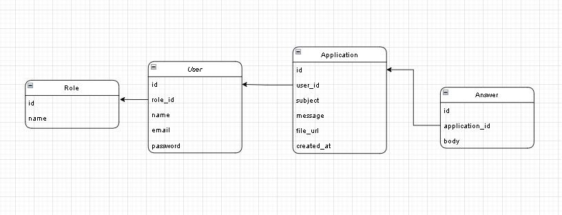

<p align="center"><a href="https://laravel.com" target="_blank"></a></p>


# Vaqt tez o'tadi xuddi laravel o'rganish va project qilish uchun ketgan vaqt kabi

## Portfolio My project => task Project

### Bu amaliyotda <b>Laravel</b>ni o'rganish uchun

- [Laravelda oddiy va tez route yaratish](https://laravel.com/docs/routing).
- [Murabba security ga ega controller yaratish](https://laravel.com/docs/container).
- Maxsus,qulay [Sifatli va ajoyib databasi](https://laravel.com/docs/eloquent).
- Database agnostic [Database Sxema migratsiyasi](https://laravel.com/docs/migrations).

Laravel juda kuchli va oson o'rganish uchun O'zbek tilidagi darslar [Youtobedagi: Nuraliyev O'rgatadi](https://www.youtube.com/@NuraliyevOrgatadi)


## Contributing

Kod qo'shimcha qo'shish uchun [Arabkhon Nishonov](https://github.com/arabkhondev/laravel-task).


## Project o'natish uchun 

```
 Composer install 
```
```
 npm install
```
### Laravel blade run qilish
```
 npm run dev 
 or
 yarn run dev
```

## Project foydalanuvchilari

### Manager
-login manage@smart.com
-parol: secret

### Mijoz
-login: client@smart.com
-parol: secret


## License

The Laravel framework ochiq kodli software litsenziya  [MIT license](https://opensource.org/licenses/MIT) dan olgan.


``` 
## Project Maqsadi:
 
 Ochiq sistemadagi Korxona makchiliklari uchun
 Manager va mijoz uchun mo'ljallangan
 Mijoz ro'yxatdan o'tib savollari bo'lsa so'rov qoldirish mumkin, faqat kuniga 1 marta xalos.
 shu kabi loyiha: <h3>Zikr ahlidan so'rang</h3>
 Keyinchalik web application version o'zgaradi albatta 

```

## Project database UML Strukturasi


